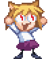

# Hey :wave:,

## I'm a student and a curious person kek!

- 📖 I'm currently studying C++
- 🇯🇵 I love listening to music and watching anime
- 🍾 2022-23 Goal: Study more about computer since

## Languages and tools:

  

	
Shortcuts

	 
	[Attivita svolta](https://github.com/plumkewe/scuola/blob/main/Attivit%C3%A0%20svolta/Attivita_svolta.md)  
	[Esercizi dal libro](https://github.com/plumkewe/scuola/tree/main/Esercizi%20dal%20libro)  
	[Come riempire un array](https://github.com/plumkewe/CPP_miei_codici/tree/main/Miei%20codici/Array/Modi%20di%20riempire)

